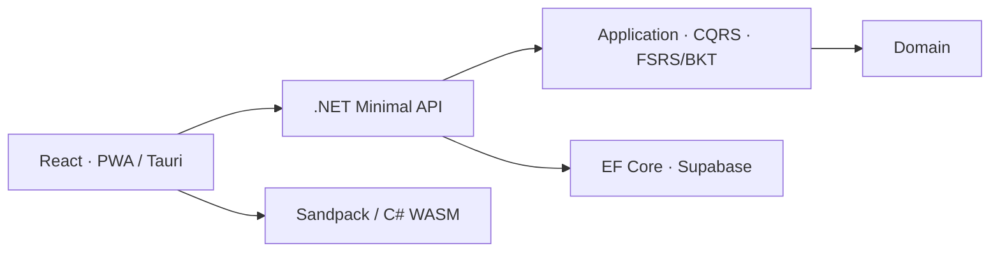

# Sharply

### Práctica técnica activa con repetición espaciada y maestría verificable

[](https://dotnet.microsoft.com/) [](https://react.dev/) [](./docs/decisions.md) [](#alcance-público)

Sharply ayuda a desarrolladores a recuperar habilidades reales de C#, .NET, EF Core, React y entrevistas mediante ejercicios que se ejecutan y evalúan, no lectura pasiva.

> Este repositorio documenta arquitectura, decisiones y una muestra independiente. El producto principal permanece privado.

## Problema

El uso intensivo de IA puede debilitar la práctica deliberada. Sharply combina ejecución de código en cliente, ejercicios activos, FSRS para decidir cuándo repasar y BKT para estimar maestría por concepto.

## Mi responsabilidad

Arquitectura y desarrollo full-stack: Clean Architecture, motor de aprendizaje en C# puro, autenticación JWT, frontend React/PWA, experiencia multiplataforma y ADR técnicos.

## Capacidades demostradas

- Domain y Application libres de dependencias web/persistencia.
- CQRS por vertical slice con dispatchers propios.
- FSRS-6 y BKT como lógica determinista testeable.
- Supabase Auth; JWT ES256/RS256 validado por la API.
- EF Core/PostgreSQL, RLS como defensa en profundidad.
- PWA, Tauri desktop/Android e i18n en cinco idiomas.
- 18 ADR públicos en el repositorio privado de trabajo.

## Arquitectura



Lee [arquitectura](./docs/architecture.md), [decisiones](./docs/decisions.md) y [roadmap](./docs/roadmap.md).

## Muestra pública

`SpacedReviewScheduler` muestra una política pequeña, determinista e inmutable de repaso. No copia el algoritmo productivo completo.

```bash
dotnet test tests/Sharply.PublicSample.Tests.csproj
```

Revisa [código](./sample-code/SpacedReviewScheduler.cs), [pruebas](./tests/SpacedReviewSchedulerTests.cs) y [OpenAPI](./api/openapi.yaml).

## Demo

La demo pública está pendiente de un perfil invitado con progreso separado y ejercicios licenciados para publicación.

## Resultados verificables

- Separación explícita entre scheduling, maestría y gamificación.
- Pruebas deterministas del scheduler y pruebas Vitest de actividades.
- Arquitectura documentada mediante ADR, incluidas alternativas descartadas.

No se afirma mejora de aprendizaje sin un estudio o datos suficientes.

## Alcance público

| Público | Privado |
| --- | --- |
| Modelo arquitectónico y ADR resumidos | Código de producto y contenido curricular |
| Scheduler simplificado y tests | Parámetros, telemetría y datos de usuarios |

Capturas futuras: [screenshots/README.md](./screenshots/README.md). Seguridad: [SECURITY.md](./SECURITY.md).
