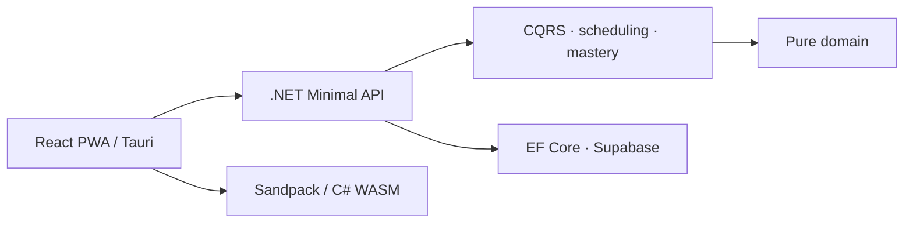

# Sharply — Active Developer Learning

### Deterministic learning models, executable practice, and interview preparation

[](https://dotnet.microsoft.com/) [](./docs/architecture.md) [](https://react.dev/) [](./docs/decisions.md)

Sharply rebuilds practical C#, .NET, EF Core, React, and interview skills through executable exercises rather than passive reading. Scheduling and mastery are modeled separately so motivation mechanics cannot corrupt learning decisions.

> The product source and curriculum remain private. This repository provides an engineering case study and independently written algorithms/tests.

## The problem

Heavy AI assistance can reduce deliberate practice. Sharply uses active exercises, code execution, spaced repetition, and concept-level mastery to make skill recovery measurable.

## My role

I designed the architecture, learning engine, authentication boundary, frontend platform, and technical decision process. The codebase is intentionally designed to be readable enough to teach the same engineering practices the product exercises.

## Engineering highlights

- Clean Architecture enforced by project dependencies.
- CQRS-style vertical slices with custom dispatchers.
- Deterministic spaced-repetition and Bayesian mastery logic in pure C#.
- Supabase Auth JWT validation with roles and RLS defense in depth.
- EF Core/PostgreSQL persistence behind application ports.
- Client-side Sandpack and C# WASM execution boundaries.
- React PWA with Tauri targets and five-language i18n.
- 18 recorded architectural decisions in the private repository.

## Architecture



Read [architecture](./docs/architecture.md), [decisions](./docs/decisions.md), and [engineering evidence](./docs/engineering-evidence.md).

## Public code samples

| Sample | Demonstrates |
| --- | --- |
| `SpacedReviewScheduler` | Immutable state and deterministic intervals |
| `BayesianMasteryModel` | Pure probability update with guarded parameters |
| `SubmitReviewHandler` | Application handler depending on ports, not EF/HTTP |
| xUnit tests | Deterministic edge cases and invalid-state rejection |

```bash
dotnet test tests/Sharply.PublicSample.Tests.csproj
```

## Challenges addressed

1. Separating when to review from whether a concept is mastered.
2. Keeping gamification from manipulating learning intervals.
3. Executing learner code without running arbitrary code in the main API.
4. Making algorithms deterministic and testable without infrastructure.
5. Supporting web/desktop/Android from one frontend codebase.

## Evidence standard

This case study does not claim learning improvement without a controlled measurement. It demonstrates implementation quality, architecture, and reproducible tests.

## Demo and scope

A guest demo is planned after public exercises and isolated progress are available. Curriculum, user data, parameters, and production source remain private.

## License

MIT applies only to the public samples.
